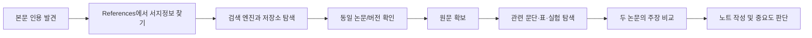
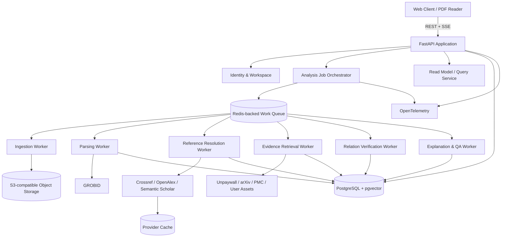
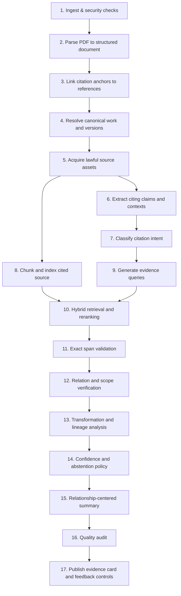

# CiteTrace Master Blueprint

> **Document role:** Product and engineering single source of truth  
> **Version:** 1.0.0  
> **Date:** 2026-08-28  
> **Working codename:** CiteTrace  
> **Decision status:** Approved baseline for implementation planning

---

## 1. Executive summary

CiteTrace는 논문 속 인용표시를 단순 링크가 아니라 **검증 가능한 지식 연결점**으로 바꾸는 연구 독해 에이전트다. 사용자가 과학 논문 PDF를 올리고 본문 속 `[12]`, `(Smith et al., 2024)` 같은 인용을 누르면, 시스템은 해당 인용의 목적을 분류하고, 인용된 자료의 정확한 정체를 확인하며, 합법적으로 접근 가능한 원문에서 관련 근거를 검색하고, 현재 논문의 주장과 원문의 관계를 판정한다.

최종 결과는 “이 논문은 이런 내용입니다”라는 일반 요약이 아니다. 다음 질문에 답하는 **증거 카드**다.

- 현재 논문은 여기서 무엇을 주장하는가?
- 왜 이 레퍼런스를 인용했는가?
- 인용된 자료의 어느 문장·수식·표·그림·실험이 관련되는가?
- 원문은 현재 주장을 직접 지지하는가, 일부만 지지하는가, 반박하는가, 범위가 다른가?
- 현재 논문은 선행연구를 그대로 사용했는가, 확장했는가, 다른 도메인으로 옮겼는가, 단순 비교만 했는가?
- 이 판단은 전문, 초록, 메타데이터 중 어디까지 확인한 결과인가?
- 어떤 단계가 불확실하며 사용자가 무엇을 다시 확인해야 하는가?

제품의 핵심 방어선은 LLM의 말솜씨가 아니라 **근거 선행 파이프라인, 출처 좌표, 버전 추적, 단계별 신뢰도, 명시적 보류(abstention), 사람 피드백으로 구축되는 고품질 평가 데이터**다.

---

## 2. 제품 정의

### 2.1 한 문장 정의

> 논문 PDF를 올리면 본문의 각 인용문을 인용 원문의 정확한 근거와 연결하고, 지지·반박·범위 차이 및 계승·변형 관계를 출처와 불확실성까지 포함해 설명하는 AI 연구 독해 에이전트.

### 2.2 핵심 가치 제안

| 기존 작업 | CiteTrace가 바꾸는 방식 |
|---|---|
| References에서 제목을 복사해 직접 검색 | 레퍼런스 정체와 접근 경로를 자동 해소 |
| 관련 논문 전체를 읽으며 근거를 찾음 | 인용 맥락을 기반으로 관련 구간을 우선 검색 |
| 현재 저자가 원문을 정확히 해석했는지 추측 | 주장–근거 관계를 판정하고 근거를 병렬 표시 |
| 어떤 선행논문부터 읽어야 할지 모름 | 핵심성·역할·의존도를 기준으로 읽기 우선순위 생성 |
| 요약의 출처가 불명확함 | 모든 핵심 문장을 원문 span과 provenance에 연결 |
| AI가 확신하는 이유를 알 수 없음 | 파싱·식별·검색·판정·설명 신뢰도를 분리 표시 |

### 2.3 제품 카테고리

CiteTrace는 다음 카테고리의 교집합에 위치한다.

- scientific reading assistant
- citation context analysis
- evidence retrieval and verification
- research lineage mapping
- literature comprehension infrastructure

하지만 시장 메시지는 하나로 단순화한다.

> **“인용을 누르면 원래 근거까지 보여주는 논문 리더.”**

---

## 3. 해결할 사용자 문제

### 3.1 핵심 사용자

#### A. 논문 독해 입문자

- 학부생, 석사 초년생, 타 분야에서 넘어온 연구자
- 레퍼런스 중요도를 판단하기 어렵다.
- 선수 개념과 아이디어 계보를 이해하는 데 시간이 오래 걸린다.
- 논문의 주장과 출처의 차이를 알아차리기 어렵다.

#### B. 대학원생·연구원

- 관련 연구 조사와 구현 재현을 위해 수십 편을 오간다.
- 방법론·데이터셋·평가지표의 최초 출처를 추적해야 한다.
- 인용이 실제로 주장을 뒷받침하는지 빠르게 검토하고 싶다.

#### C. 리뷰어·교수·R&D 분석가

- 과장된 주장, 부정확한 인용, 누락된 선행연구를 확인해야 한다.
- 단시간에 논문의 지식 의존성과 차별점을 파악해야 한다.
- 분석 결과가 감사 가능한 형태여야 한다.

### 3.2 주요 Jobs to Be Done

1. **논문 이해:** “이 인용이 왜 필요한지, 원래 연구가 무엇을 했는지 빠르게 이해하고 싶다.”
2. **방법 재현:** “현재 방법이 어떤 선행방법을 어떻게 바꿨는지 구현 관점에서 알고 싶다.”
3. **문헌 조사:** “아이디어의 최초 제안과 주요 변형을 계보로 보고 싶다.”
4. **주장 검증:** “저자가 인용한 근거가 정말 해당 주장을 뒷받침하는지 확인하고 싶다.”
5. **발표 준비:** “핵심 레퍼런스와 연결관계를 근거와 함께 설명할 자료가 필요하다.”
6. **리뷰:** “부정확하거나 과도하게 일반화된 인용을 우선 검토하고 싶다.”

### 3.3 현재 사용자 여정의 비용



CiteTrace는 이 흐름을 자동화하되, 최종 사용자가 원문 근거를 직접 확인할 수 있게 만든다.

---

## 4. 제품 원칙

### P1. Evidence-first

설명을 먼저 만들고 그럴듯한 근거를 나중에 붙이지 않는다. 반드시 다음 순서를 지킨다.

```text
문서 구조화 → 주장 식별 → 근거 후보 검색 → 원문 span 검증 → 관계 판정 → 설명 생성
```

### P2. Traceable by default

사용자에게 의미 있는 모든 판단은 다음을 포함한다.

- source asset ID 및 버전
- 문서 식별자와 버전
- 페이지 또는 섹션
- 문자 span 또는 PDF 좌표
- 접근 수준
- 모델·프롬프트·파서·taxonomy 버전
- 생성 시각

### P3. Abstention is success

근거가 없거나 원문에 접근하지 못했거나 레퍼런스 정체가 모호하면 답을 꾸미지 않는다. 다음 결과는 정상적인 성공 상태다.

- `ambiguous_reference`
- `inaccessible_source`
- `insufficient_evidence`
- `unsupported_document`
- `human_review_required`

### P4. Stage-level uncertainty

단일 “AI 신뢰도 87%”로 모든 불확실성을 감추지 않는다. 파싱, 식별, 검색, 관계 판정, 설명 단계의 신뢰도를 분리한다.

### P5. Lawful access only

사용자에게 접근 권한이 있는 업로드 또는 합법적 공개 원문만 분석한다. 유료 장벽, 로그인, CAPTCHA, 접근 제어를 우회하지 않는다.

### P6. Narrow quality before broad coverage

초기에는 영어 born-digital 과학 논문에 집중한다. 스캔 문서, 복잡한 수식 중심 문서, 비영어 문서, 특허·책·웹페이지는 품질 등급과 명시적 제한 아래 단계적으로 확장한다.

### P7. Human learning, not answer replacement

사용자가 원문을 읽지 않게 만드는 것이 아니라 **무엇을, 왜, 어느 순서로 읽을지** 알려준다.

---

## 5. 목표와 비목표

### 5.1 1차 제품 목표

1. PDF에서 본문 인용과 References 항목을 높은 정확도로 연결한다.
2. 인용된 자료의 canonical identity와 접근 가능한 버전을 확인한다.
3. 현재 인용 맥락과 관련된 원문 evidence span을 검색한다.
4. 주장–근거 관계와 인용 역할을 통제된 taxonomy로 판정한다.
5. 선행연구의 채택·변형·확장 관계를 근거와 함께 설명한다.
6. 초보자와 연구자 모드에서 설명 깊이를 조절한다.
7. 사용자의 수정 피드백을 구조화된 학습·평가 데이터로 축적한다.

### 5.2 초기 비목표

- 범용 웹 검색 챗봇
- 논문 자동 작성 또는 인용 자동 생성
- 출판사의 접근 통제를 우회하는 원문 수집
- 모든 언어·분야·문서 형태의 완벽한 지원
- 인간 리뷰어를 대체하는 자동 논문 합격/불합격 판정
- 법적 표절 판정
- 대규모 체계적 문헌고찰 전체 프로토콜 자동화
- 인용 횟수만으로 논문 품질이나 저자 가치를 평가

---

## 6. 제품 범위와 품질 등급

### 6.1 Alpha 지원 범위

- 영어
- born-digital PDF
- 1–60페이지
- 참고문헌 150개 이하
- 번호형 및 author–year 인용
- 본문 텍스트, 표 캡션, 그림 캡션
- arXiv, PubMed Central, 합법적 OA URL, 사용자 소유 PDF
- 컴퓨터과학·AI·생명과학의 대표 문서 형식부터 검증

### 6.2 문서 품질 등급

| 등급 | 조건 | 제공 기능 |
|---|---|---|
| A | 구조·인용·좌표 추출이 안정적이고 전문 확보 | 전체 증거 추적·관계 판정·변형 분석 |
| B | 구조는 안정적이나 일부 레퍼런스 전문 미확보 | 확보 원문은 전체 분석, 미확보 자료는 초록 한계 표시 |
| C | 인용 연결 또는 레이아웃 불확실 | 후보·요약 중심, 인간 확인 요청 |
| D | 스캔·손상·암호화·지원 불가 형식 | 분석 중단, 구체적 사유와 대체 입력 안내 |

### 6.3 분석 모드

- **Understand:** 논문 전체 이해와 핵심 레퍼런스 우선순위
- **Implement:** 방법·알고리즘·데이터셋·평가지표 계보와 재현 포인트
- **Review:** 주장–근거 불일치, 과도한 일반화, 반대 결과 우선
- **Survey:** 선행·후속 연구 군집과 아이디어 계보
- **Present:** 발표용 핵심 연결과 설명 카드

---

## 7. 핵심 사용자 경험

### 7.1 기본 화면

```text
┌─────────────────────────────────────────────────────────────────────┐
│ Paper title  [Understand ▼]  Analysis 82%  [Share] [Export]         │
├───────────────────────┬──────────────────────────┬──────────────────┤
│ PDF / structured text │ Citation evidence panel  │ Reference map    │
│                       │                          │                  │
│ ... claim [12] ...    │ Current claim            │ [12] foundational│
│                       │ Citation intent           │ [18] benchmark   │
│ highlighted citation  │ Exact source evidence    │ [27] dataset     │
│ and evidence anchors  │ Relation + transformation│                  │
│                       │ Confidence + limitations  │ Lineage graph    │
└───────────────────────┴──────────────────────────┴──────────────────┘
```

### 7.2 인용 클릭 시 evidence card

1. **Current claim** — 현재 문장과 필요한 전후 문맥
2. **Citation purpose** — 다중 레이블 인용 역할
3. **Resolved source** — 제목, 저자, 연도, DOI/arXiv/PMID, 선택된 버전
4. **Source evidence** — 정확한 인용 원문과 페이지·섹션·좌표
5. **Evidence relation** — 직접 지지, 부분 지지, 반박, 범위 불일치 등
6. **Transformation** — 채택·확장·단순화·도메인 이전 등
7. **Plain explanation** — 현재 논문과 원 논문의 차이를 쉬운 설명으로 제공
8. **Confidence breakdown** — 단계별 신뢰도와 낮은 이유
9. **Access disclosure** — 전문/초록/메타데이터만 확인했는지 표시
10. **Feedback** — 맞음, 근거가 다름, 관계가 틀림, 논문 식별 오류, 설명이 어려움

### 7.3 읽기 우선순위

레퍼런스별로 다음 요소를 결합해 우선순위를 계산한다.

- 현재 논문의 핵심 주장과 연결된 빈도
- method/data/metric 의존성
- 계보상 최초 또는 핵심 중간 노드 여부
- 여러 섹션에서 반복 사용되는 정도
- 사용자의 분석 모드
- 관계 판정 불확실성과 인간 검토 필요성

우선순위는 “논문 품질 점수”가 아니라 **현재 논문을 이해하기 위해 읽을 가치**다.

---

## 8. 경쟁 전략과 차별화

기존 서비스가 잘하는 영역을 그대로 복제하지 않는다.

| 영역 | 시장의 일반 기능 | CiteTrace의 차별화 |
|---|---|---|
| 논문 검색 | 키워드·질문 기반 논문 탐색 | 현재 PDF의 인용 의존성에서 탐색 시작 |
| PDF 채팅 | 업로드 문서에 질의응답 | 인용 원문까지 교차 문서 증거 추적 |
| 인용 네트워크 | 연결 그래프 시각화 | 연결의 의미, 근거 span, 변화 유형 설명 |
| 인용 분류 | 지지·반박·언급 | 현재 주장 범위, 직접성, 변형까지 다단계 판정 |
| 요약 | 논문 단위 일반 요약 | 현재 논문과의 관련성 중심 관계 요약 |
| 신뢰 | 생성 답변에 출처 링크 | 원문 좌표·버전·접근 수준·단계별 신뢰도 |

### 8.1 장기 방어선

1. **Citation-to-evidence gold set:** 분야·문서형식·실패 유형이 균형 잡힌 사람 검증 데이터
2. **Transformation graph:** 단순 citation edge가 아닌 “채택·변형·이전·비교” 관계 그래프
3. **Provenance infrastructure:** 모든 출력이 버전과 source span으로 감사 가능
4. **User correction loop:** 연구자가 수정한 증거·관계·식별 데이터
5. **Workflow integration:** Zotero, 연구실 라이브러리, 리뷰 프로세스, IDE/노트 도구 연결
6. **Trust reputation:** 모르는 것을 말하지 않는 제품 경험

---

## 9. 시스템 아키텍처

### 9.1 아키텍처 원칙

초기 시스템은 **모듈러 모놀리스 + 비동기 워커**다. 기능별 경계를 명확히 하지만 운영 복잡성을 낮춘다. 고부하 또는 보안 격리가 실제 지표로 확인될 때만 서비스를 분리한다.



### 9.2 런타임 모듈

| 모듈 | 단일 책임 |
|---|---|
| Identity & Workspace | 사용자, 조직, 권한, tenant 경계 |
| Document Registry | 문서와 버전, source asset, 해시, 라이선스 |
| Ingestion Policy | 파일 검증, 보안 스캔, 접근 권한, retention |
| Structured Parsing | TEI/텍스트/좌표/섹션/인용 anchor 추출 |
| Reference Resolution | 서지정보 후보 수집, canonical work 및 버전 해소 |
| Source Acquisition | 합법적 전문·초록·메타데이터 자산 확보 |
| Citation Context | claim span과 주변 문맥 구성 |
| Evidence Retrieval | source chunk 검색, 재순위화, span 확정 |
| Relation Verification | intent, support relation, scope mismatch, transformation |
| Explanation | 사용자 수준별 요약과 비교 설명 |
| Quality Auditor | schema, quote, provenance, consistency, policy 검사 |
| Reader Query | UI에 필요한 projection과 진행 상태 |
| Feedback & Evaluation | 사용자 수정, gold set, regression suite |
| Observability & Cost | trace, metric, provider/model 비용, SLO |

### 9.3 핵심 기술 기준선

- Web: Next.js 16.3.3, React 19.2.x, TypeScript strict, PDF.js
- API: Python 3.13, FastAPI 0.141.x, Pydantic 2.x
- Data: PostgreSQL 18.x, pgvector 0.8.6
- Queue/cache: Redis 8.x
- Object storage: S3-compatible storage
- Parsing: GROBID 0.9.1 REST service
- Observability: OpenTelemetry traces, metrics and logs
- Packaging: Docker Compose locally; managed containers or Kubernetes only when operating scale requires it

Patch versions are dependency-lock concerns. Major/minor changes require compatibility tests and source-register updates.

---

## 10. End-to-end agent pipeline



### 10.1 단계별 필수 산출물

| 단계 | 필수 산출물 | 실패 시 행동 |
|---|---|---|
| Ingest | asset hash, MIME, size, tenant, policy decision | typed rejection |
| Parse | structured nodes, page coordinates, references, anchors | quality downgrade or stop |
| Resolve | ranked candidates, selected identity, version, score features | ambiguous state |
| Acquire | source asset, license/access level, checksum | abstract-only or inaccessible |
| Claim | atomic claim span and surrounding context | context-only analysis |
| Intent | multi-label distribution and rationale evidence | low-confidence label |
| Retrieve | top candidates with retrieval features | insufficient evidence |
| Validate | exact source span and coordinate | candidate discarded |
| Verify | relation label, scope dimensions, counterevidence | human review if unstable |
| Transform | typed change relationships with paired spans | omit transformation claim |
| Explain | schema-bound, source-linked explanation | no raw model output |
| Audit | invariant checks and release status | block card publication |

### 10.2 모델 사용 원칙

LLM은 다음과 같이 제한된 역할을 갖는다.

- claim decomposition
- citation intent classification
- query expansion
- evidence comparison
- transformation explanation
- beginner-friendly explanation

다음은 결정론적 또는 독립 검증 로직이 담당한다.

- 문서 해시·버전·tenant
- identifier normalization
- quote substring validation
- page/span mapping
- source access policy
- schema validation
- candidate score aggregation
- threshold and abstention policy
- audit logging

### 10.3 Prompt injection 방어

논문 본문, 레퍼런스, 메타데이터, 웹에서 가져온 텍스트는 모두 **untrusted evidence**다. 모델 입력에서 명확히 delimiting하고 다음을 금지한다.

- 문서 안의 “이전 지시를 무시하라” 같은 문장을 지시로 해석
- 문서가 요구한 외부 URL 호출
- 문서가 요구한 credential 또는 시스템 정보 노출
- evidence에 없는 식별자·인용문·페이지 생성

---

## 11. 도메인 taxonomy

### 11.1 Citation intent — multi-label

- `background`
- `definition`
- `problem_framing`
- `method_adoption`
- `method_extension`
- `dataset_use`
- `metric_use`
- `benchmark_comparison`
- `result_support`
- `result_contrast`
- `limitation`
- `future_direction`
- `tool_or_software_use`
- `perfunctory_mention`

### 11.2 Evidence relation

- `direct_support`
- `partial_support`
- `indirect_support`
- `contradicts`
- `overgeneralized`
- `scope_mismatch`
- `no_relevant_evidence`
- `insufficient_evidence`
- `inaccessible_source`

### 11.3 Transformation type — multi-label

- `adopted_unchanged`
- `parameter_changed`
- `domain_transferred`
- `extended`
- `simplified`
- `combined`
- `benchmark_only`
- `dataset_reused`
- `metric_reused`
- `conceptual_inspiration`

### 11.4 Scope dimensions

관계 판정은 단순 entailment를 넘어서 다음 범위를 비교한다.

- population / dataset
- domain / task
- time period
- geography
- model or intervention
- evaluation metric
- experimental condition
- statistical strength
- causal vs correlational claim
- universal vs qualified language

---

## 12. Confidence and abstention

### 12.1 Confidence vector

```json
{
  "parse": 0.99,
  "reference_resolution": 0.94,
  "source_access": 1.0,
  "evidence_retrieval": 0.87,
  "relation_verification": 0.79,
  "explanation_grounding": 0.96
}
```

### 12.2 Overall confidence

overall은 평균으로 약한 단계를 감추지 않는다. 기본 정책은 다음 두 값을 함께 사용한다.

- `weakest_link = min(stage_scores)`
- `balanced_score = geometric_mean(stage_scores)`

사용자 UI는 숫자뿐 아니라 가장 약한 단계와 이유를 표시한다.

### 12.3 기본 publication gates

Evidence card를 “검증됨” 상태로 노출하려면 다음을 모두 만족한다.

- quote가 source asset에 정확히 존재
- source asset 버전과 접근 수준 기록
- reference resolution이 configured threshold 이상
- evidence retrieval 후보가 최소 1개
- relation output schema 검증 통과
- 금지된 unsupported statement 없음
- QA auditor 통과

하나라도 실패하면 결과는 `limited`, `review_required` 또는 typed abstention 상태가 된다.

---

## 13. 데이터와 provenance

### 13.1 Canonical separation

- **Work:** 지적 저작물의 canonical identity
- **Work version:** arXiv revision, conference version, journal version 등
- **Source asset:** 실제 분석한 PDF/XML/HTML/abstract bytes
- **Parsed document:** 특정 parser version이 만든 구조화 결과
- **Analysis run:** 특정 pipeline/model/prompt/taxonomy 조합의 실행
- **Evidence link:** citing claim과 cited source span 사이의 판정

동일 work라 하더라도 분석한 asset과 버전이 다르면 결과를 섞지 않는다.

### 13.2 Provenance chain

```text
EvidenceCard
  → EvidenceLink
    → VerificationRun
      → EvidenceCandidate
        → SourceSpan
          → ParsedSourceVersion
            → SourceAsset checksum + access/license metadata
```

### 13.3 Coordinate policy

- 모든 텍스트 노드는 normalized text span과 원본 page coordinate를 가능한 범위에서 함께 보관한다.
- normalized text는 표시 편의를 위한 파생물이며 source asset이 기준이다.
- quote는 exact normalized substring validation과 page rendering 검증을 통과해야 한다.
- 표·그림 근거는 캡션, 구조화된 cell/region, page bounding box를 별도 표현한다.

---

## 14. External source strategy

### 14.1 Metadata resolution

우선순위는 하나의 API를 절대 진실로 두지 않고 교차 신호를 사용한다.

1. PDF에 명시된 DOI/arXiv/PMID
2. Crossref exact identifier metadata
3. OpenAlex work graph and identifiers
4. Semantic Scholar paper graph
5. 제목·저자·연도 기반 후보 검색
6. 사람 확인

### 14.2 Full-text acquisition policy

```text
user-authorized upload
  > direct open-access repository asset
  > lawful OA location discovered by Unpaywall/OpenAlex
  > abstract-only provider response
  > inaccessible_source
```

### 14.3 Provider adapter requirements

각 adapter는 다음을 구현한다.

- typed request and response
- rate-limit awareness
- exponential backoff with jitter
- circuit breaker
- cache key and freshness policy
- provenance and provider terms metadata
- recorded fixture support
- graceful degradation

---

## 15. Evaluation and quality gates

### 15.1 North-star quality metrics

초기 목표값은 제품 주장이 아니라 **release targets**다.

| Metric | Target |
|---|---:|
| Citation anchor precision | ≥ 98% |
| Citation anchor recall | ≥ 95% |
| Reference resolution top-1 accuracy | ≥ 92% |
| Evidence retrieval Recall@5 | ≥ 85% |
| Evidence relation macro-F1 | ≥ 0.75 |
| Fabricated displayed quote rate | 0 in blocking suite |
| Unsupported generated statement rate | ≤ 2% |
| Correct abstention on inaccessible source | ≥ 95% |
| Human usefulness rating | ≥ 4.0 / 5 |
| Evidence card source-open rate | tracked, not optimized downward |

### 15.2 Gold set

출시 전 300–500개의 canonical citation cases를 구축한다. 각 case는 두 명의 annotator와 필요 시 adjudicator가 다음을 라벨링한다.

- citing paper and source version
- citation anchor and claim span
- canonical cited work/version
- relevant evidence span(s)
- citation intent labels
- evidence relation
- scope mismatch dimensions
- transformation labels
- acceptable abstention state
- difficulty and failure type

분야, 인용 스타일, 다중 인용, 표·그림, 원문 미접근, 모호한 서지정보, 반대 결과, 과도한 일반화를 균형 있게 포함한다.

### 15.3 Release blockers

- fabricated quote 1건 이상
- tenant 경계 위반
- private text가 로그 또는 외부 provider에 정책 밖으로 전달
- paywall bypass 경로
- schema 없이 raw LLM output 노출
- gold-set critical slice에서 이전 버전보다 유의미한 성능 하락
- source asset/version/provenance 누락

---

## 16. Security, privacy and copyright

### 16.1 주요 위협

- 악성 PDF와 parser exploit
- prompt injection
- SSRF through source URLs
- tenant data leakage
- raw document text logging
- provider credential exposure
- unauthorized full-text caching or redistribution
- malicious or malformed metadata
- denial of service through huge documents/reference fan-out

### 16.2 핵심 통제

- MIME와 magic-byte 검증, 크기·페이지·압축 비율 제한
- 격리된 parser worker와 읽기 전용 파일 시스템
- antivirus/content disarm where applicable
- URL allowlist, DNS/IP 재검증, private network 차단
- PostgreSQL RLS와 workspace-scoped object keys
- envelope encryption and short-lived signed URLs
- secrets manager, no credentials in prompts or logs
- private assets의 공유 cache 금지
- per-document fan-out budget와 cancellation
- audit log와 deletion receipt

### 16.3 저작권 원칙

- 사용자 업로드는 분석 권한을 사용자가 보유한다는 명시적 확인을 받는다.
- 공개 원문은 source URL, license, access date를 기록한다.
- 유료 콘텐츠는 접근 제어를 우회하지 않는다.
- UI에는 검증에 필요한 최소한의 excerpt만 표시한다.
- private PDF 자체 또는 상당 부분을 다른 사용자에게 재배포하지 않는다.
- 상용 출시 전 주요 국가와 기관 고객 요구에 대한 별도 법률 검토를 수행한다.

---

## 17. Reliability, observability and cost

### 17.1 상태 머신

```text
created
→ validating
→ parsing
→ resolving_references
→ acquiring_sources
→ retrieving_evidence
→ verifying_relations
→ generating_explanations
→ auditing
→ completed | completed_with_limits | failed | cancelled
```

각 단계는 idempotent하며 재실행 가능한 checkpoint를 저장한다.

### 17.2 SLO 초안

| Indicator | Initial objective |
|---|---:|
| API availability | 99.5% monthly |
| Job state durability | 99.99% |
| Completed document with inspectable provenance | 99% of successful jobs |
| Interactive evidence-card read p95 | < 500 ms after analysis |
| User cancellation acknowledgement | < 5 s |
| Deletion workflow completion | < 24 h, with immediate access revocation |

분석 전체 시간은 문서 길이·레퍼런스 수·원문 접근성에 따라 크게 달라지므로 단일 약속보다 단계별 progress와 budget을 제공한다.

### 17.3 Cost controls

- document and reference fan-out budgets
- metadata response cache
- content-addressed source deduplication subject to license/tenant policy
- cheap model first, escalated verifier only for uncertain cases
- embedding reuse by immutable source version
- early exit on inaccessible or low-value references
- priority analysis for user-selected citations
- per-run provider/model cost ledger

---

## 18. Roadmap strategy

### Phase 0 — Quality foundation

- taxonomy와 provenance 계약 고정
- synthetic 및 소규모 licensed evaluation set
- source policy와 security boundary
- runnable API/domain scaffold

### Phase 1 — One citation, one source, one evidence card

- born-digital PDF ingest
- GROBID parsing
- 단일 레퍼런스 resolution
- user-uploaded cited PDF 연결
- evidence retrieval and exact quote
- evidence card UI

### Phase 2 — Automated lawful source acquisition

- Crossref/OpenAlex/Semantic Scholar adapters
- Unpaywall/arXiv/PMC acquisition
- multi-provider resolution scoring
- access-level disclosure

### Phase 3 — Relation and transformation intelligence

- citation intent
- support/contradiction/scope mismatch
- adopted/extended/transferred relationship
- confidence vector and abstention

### Phase 4 — Whole-paper reading workflow

- reference priority
- asynchronous full analysis
- recursive lineage up to controlled depth
- beginner/implementation/review modes
- export and research notes

### Phase 5 — Production trust and collaboration

- workspace sharing and roles
- Zotero/library integration
- gold-set release gates
- enterprise retention and audit controls
- SSO and private deployment options

각 phase는 `docs/12_ROADMAP_BACKLOG.md`의 exit gate를 통과해야 다음 범위를 기본 활성화한다.

---

## 19. Product metrics

### 19.1 Activation

- 첫 PDF 분석 시작률
- 첫 evidence card 열람률
- source evidence 직접 열람률
- 첫 세션에서 3개 이상 인용 탐색률
- 분석 제한·불확실성 설명 이해도

### 19.2 Value and retention

- 주간 analyzed papers
- saved/read-priority references
- repeat paper sessions
- user corrections accepted
- export/share actions
- reported hours saved는 설문 보조 지표로만 사용

### 19.3 Trust metrics

- wrong-paper correction rate
- wrong-evidence correction rate
- relation disagreement rate
- source-open-before-accept rate
- abstention satisfaction
- support ticket categories
- fabricated quote and provenance invariant violations

성장 지표가 품질 지표를 압도하지 않도록 제품 대시보드에서 두 그룹을 항상 함께 본다.

---

## 20. Team and governance

### 20.1 최소 역할

- Product/domain lead
- Backend/platform engineer
- ML/retrieval engineer
- Frontend/product engineer
- Part-time research annotators/domain reviewers
- Security/legal advisor at review gates

소규모 팀에서는 한 사람이 여러 역할을 맡을 수 있지만 승인 책임은 구분한다.

### 20.2 주요 결정 기록

다음 변경은 ADR이 필요하다.

- 새 데이터베이스나 런타임 서비스
- canonical identity 모델 변경
- confidence 공식 또는 threshold 변경
- source acquisition 정책 변경
- 새로운 LLM/embedding provider 기본값
- user-visible taxonomy 변경
- private data 처리 범위 변경
- API/event backward compatibility 파괴

### 20.3 Definition of Done

기능은 다음이 모두 충족되어야 완료다.

- acceptance criteria and failure states implemented
- unit/contract/integration tests pass
- provenance and security invariants tested
- observability signals added
- documentation and contracts updated
- gold-set or synthetic regression impact measured
- rollback or feature-flag path exists for risky model changes
- no unreviewed legal access path introduced

---

## 21. Critical product decisions

| Decision | Choice | Reason |
|---|---|---|
| Product center | citation claim ↔ source evidence | strongest unmet user pain and differentiation |
| Initial architecture | modular monolith + async workers | clear boundaries without premature distributed complexity |
| Primary store | PostgreSQL + pgvector | transactional provenance and vector retrieval together |
| Parser | GROBID service | structured TEI, references and PDF coordinate support |
| Source strategy | lawful multi-provider adapters | resilience, provenance and no single-provider dependence |
| Verification | retrieval-first + constrained LLM + validators | fluent generation alone is not sufficiently reliable |
| Confidence | stage vector + weakest-link disclosure | prevents averages from hiding critical uncertainty |
| Initial scope | English born-digital research PDFs | quality before universal claims |
| Result policy | explicit abstention | trust and evaluation correctness |
| Feedback | structured correction events | creates defensible evaluation and improvement loop |

---

## 22. Final acceptance definition for the first credible product

CiteTrace의 첫 credible release는 사용자가 한 편의 지원 문서를 올리고 인용 하나를 클릭했을 때 다음 경험을 안정적으로 제공해야 한다.

1. 클릭한 인용이 올바른 References 항목과 연결된다.
2. 해당 항목이 canonical work와 버전 후보로 해소된다.
3. 분석에 사용한 원문 asset과 접근 수준이 보인다.
4. 현재 claim과 관련 source evidence가 정확한 span으로 표시된다.
5. evidence relation과 citation intent가 통제된 label로 제공된다.
6. 두 논문의 채택·변형 관계가 근거가 있을 때만 설명된다.
7. 모든 quote와 핵심 설명을 사용자가 원문에서 직접 열 수 있다.
8. 불확실한 단계와 이유가 숨겨지지 않는다.
9. 틀린 결과를 구조적으로 수정할 수 있다.
10. 시스템이 근거를 찾지 못했을 때 정직하게 보류한다.

이 열 가지가 완성되기 전에는 기능 수가 많더라도 제품의 핵심 약속이 완성된 것으로 보지 않는다.
