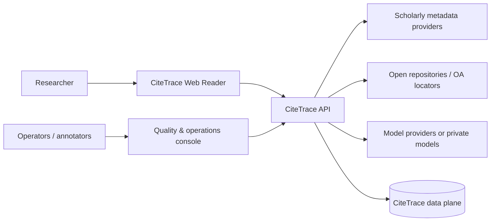
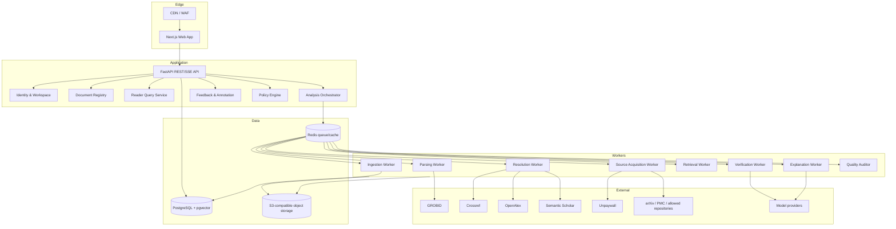
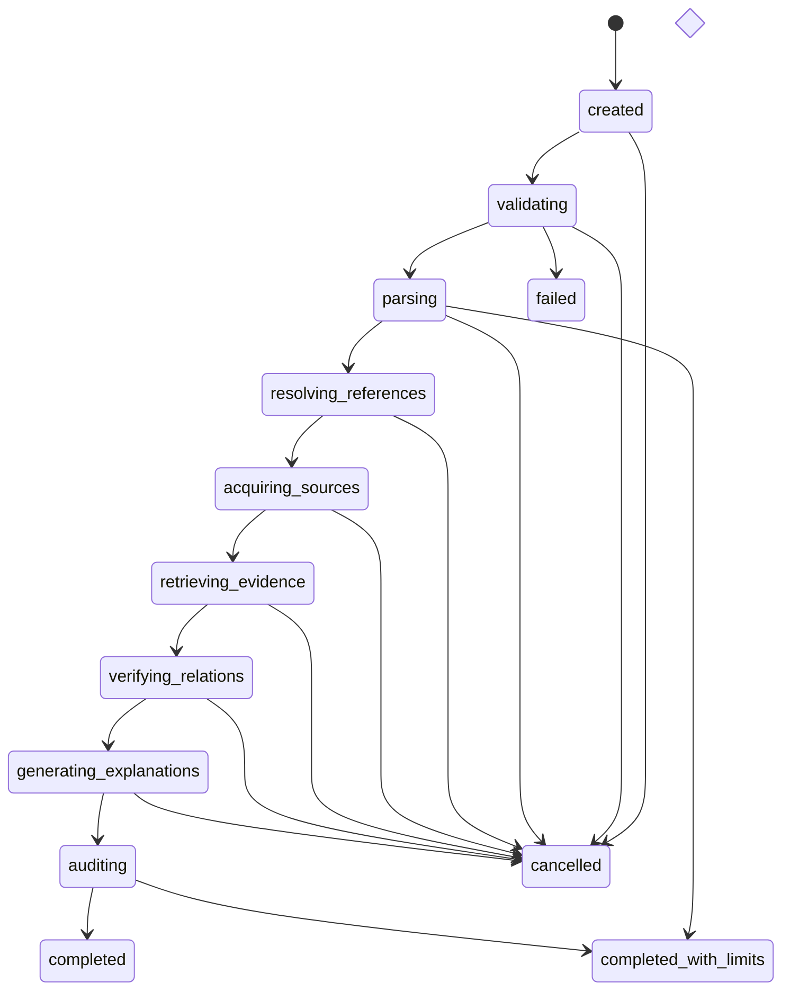
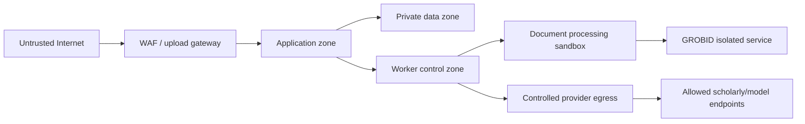

# CiteTrace System Architecture

> **Version:** 1.0.0  
> **Architecture style:** Modular monolith with asynchronous workers  
> **Primary ADR:** `adr/0001-modular-monolith.md`

---

## 1. Architectural goals

The system must:

1. preserve a complete provenance trail from user-visible statement to source bytes,
2. isolate untrusted document processing,
3. tolerate partial scholarly-provider and model outages,
4. support incremental/priority analysis rather than all-or-nothing jobs,
5. keep public contracts stable while models and retrieval strategies evolve,
6. enforce tenant, license and retention policy at every storage boundary,
7. scale expensive parsing/retrieval/model stages independently without premature service proliferation.

---

## 2. Constraints

- Scientific PDFs are untrusted and structurally inconsistent.
- Cited full text may be unavailable or available in multiple versions.
- External APIs have changing quotas, pricing and response quality.
- LLM outputs can be malformed, unsupported or influenced by document instructions.
- Analysis is asynchronous and may take substantially longer than interactive API requests.
- User trust requires inspectable partial results and explicit limitations.
- Exact source coordinates and immutable asset versions matter more than conversational fluency.

---

## 3. Context diagram



---

## 4. Logical architecture



---

## 5. Module boundaries

### 5.1 Identity & Workspace

**Owns:** users, workspaces, memberships, roles, API tokens, tenant context.  
**Does not own:** document authorization rules beyond invoking policy decisions.

Public interfaces:

```python
class WorkspaceAuthorizer(Protocol):
    async def require(self, actor_id: UUID, workspace_id: UUID, permission: Permission) -> ActorContext: ...
```

### 5.2 Document Registry

**Owns:** works, work versions, source assets, uploads, checksums, parsed document versions, access metadata.  
**Invariant:** a derived artifact always points to one immutable source asset version.

```python
class DocumentRegistry(Protocol):
    async def register_upload(self, command: RegisterUpload) -> SourceAsset: ...
    async def attach_work_identity(self, asset_id: UUID, identity: WorkVersionIdentity) -> None: ...
    async def get_asset(self, workspace_id: UUID, asset_id: UUID) -> SourceAsset: ...
```

### 5.3 Policy Engine

**Owns:** source acquisition allow/deny, retention, sharing, provider text disclosure, URL fetch policy.  
**Rule:** policy is evaluated before network fetch, storage, model transmission and sharing.

```python
class PolicyEngine(Protocol):
    def decide(self, request: PolicyRequest) -> PolicyDecision: ...
```

### 5.4 Structured Parsing

**Owns:** parser invocation, TEI normalization, section/paragraph/sentence nodes, reference entries, citation anchors, PDF coordinates, parse-quality report.  
**Does not own:** canonical reference identity.

### 5.5 Reference Resolution

**Owns:** normalized bibliographic query, provider candidates, feature scores, work/version selection, ambiguity.  
**Does not own:** fetching full-text bytes.

### 5.6 Source Acquisition

**Owns:** lawful location discovery, remote fetch, access level, license metadata, acquisition event, source asset registration.  
**Rule:** no provider URL is trusted until SSRF and content checks pass.

### 5.7 Citation Context

**Owns:** citation cluster decomposition, atomic claim spans, context windows and target association.

### 5.8 Evidence Retrieval

**Owns:** source chunking, embeddings, lexical index, query plans, candidate ranking, exact source-span extraction.  
**Does not own:** final support/contradiction judgment.

### 5.9 Verification

**Owns:** citation intent, evidence relation, scope dimensions, transformation labels, calibration features and abstention recommendation.

### 5.10 Explanation

**Owns:** relationship-centered summaries, beginner/expert renderings, reading recommendations.  
**Constraint:** every material output statement references accepted evidence or is marked as inference.

### 5.11 Quality Auditor

**Owns:** blocking invariants and publication decision.

Checks include:

- quote exists in exact asset version,
- source span coordinates are valid,
- public schema is valid,
- relation has evidence,
- access disclosure matches asset,
- explanation sentence coverage,
- prohibited claims and prompt-injection leakage,
- model/prompt/parser/taxonomy versions recorded.

### 5.12 Feedback & Evaluation

**Owns:** user feedback events, correction proposals, adjudication, gold-set exports, evaluation runs and release comparisons.

---

## 6. Dependency direction

Domain packages must not depend on FastAPI, Redis, provider SDKs or concrete model clients.

```text
HTTP / Worker adapters
        ↓
Application use cases
        ↓
Domain models and policies
        ↑
Infrastructure adapters implement domain protocols
```

Provider-specific response objects are converted at the adapter boundary. No provider field name leaks into domain entities without normalization.

---

## 7. Processing topology

### 7.1 API plane

Interactive responsibilities only:

- authentication and authorization
- validate commands
- create/idempotently retrieve jobs
- query materialized analysis state
- stream progress via SSE
- accept feedback and user corrections
- issue signed source-region URLs when authorized

The API must not parse large PDFs or call high-latency model workflows inline.

### 7.2 Worker plane

Workers consume versioned commands and produce immutable events/checkpoints. Each stage is independently retryable and idempotent.

Recommended queues:

- `ingestion`
- `parsing`
- `resolution`
- `source_acquisition`
- `retrieval`
- `verification`
- `explanation`
- `quality_audit`
- `maintenance`

A Redis-backed queue is sufficient initially. A migration to a durable broker requires observed queue semantics or scale that Redis cannot satisfy and an ADR.

### 7.3 Priority behavior

- user-clicked citation analysis: high priority
- whole-paper background expansion: normal priority
- recursive lineage and re-indexing: low priority
- evaluation and backfill: isolated batch capacity

Workspace quotas prevent one large document from starving interactive work.

---

## 8. Job state model



### 8.1 Checkpoint contract

Each stage writes:

- `analysis_run_id`
- `stage`
- `attempt`
- `input_fingerprint`
- `output_artifact_ids`
- `started_at`, `finished_at`
- `status`
- `error_code` and safe message
- provider/model usage ledger
- trace ID

A retry with the same input fingerprint either reuses the completed checkpoint or creates an explicit superseding attempt.

---

## 9. Data architecture

### 9.1 PostgreSQL

Use for:

- tenant and access control
- canonical works and versions
- source asset metadata
- parsed nodes and coordinates
- reference candidates and decisions
- claims, evidence candidates and links
- analysis state and events
- model executions and provenance
- feedback and evaluation labels

### 9.2 pgvector

Use for source-chunk embeddings and optionally claim/query embeddings. The initial embedding dimension is fixed in schema for the selected model baseline. Changing dimension uses a new column/index or embedding table version, not in-place mixing.

### 9.3 Object storage

Use content-addressed object keys plus tenant/policy namespace for:

- uploaded PDFs
- lawfully acquired source files
- normalized parser outputs
- optional page render images
- evaluation fixtures and export bundles

Private assets cannot be deduplicated across tenant access boundaries merely because checksums match.

### 9.4 Redis

Use for:

- job queues
- short-lived distributed locks
- provider rate-limit tokens
- ephemeral progress fan-out
- non-authoritative caches

Redis is never the sole source of truth for job completion or provenance.

---

## 10. External provider architecture

### 10.1 Provider protocols

```python
class ScholarlyMetadataProvider(Protocol):
    name: str
    async def lookup_identifier(self, identifier: NormalizedIdentifier) -> list[WorkCandidate]: ...
    async def search_bibliography(self, query: BibliographicQuery) -> list[WorkCandidate]: ...

class OpenAccessLocator(Protocol):
    name: str
    async def locate(self, work: CanonicalWork) -> list[SourceLocation]: ...

class ModelGateway(Protocol):
    async def generate_structured(self, request: StructuredGenerationRequest[T]) -> ModelResult[T]: ...
    async def embed(self, texts: list[str], profile: EmbeddingProfile) -> list[Embedding]: ...
```

### 10.2 Adapter safeguards

- request timeout and total stage deadline
- bounded retries with jitter
- provider-specific concurrency limit
- 429/5xx classification
- circuit breaker and degraded mode
- normalized cache and freshness
- response schema validation
- provenance record for every accepted field
- no silent fallback that changes access level

---

## 11. Security zones



### 11.1 Sandbox properties

- no inbound public network
- no default outbound internet
- read-only runtime image
- temporary writable workspace with quota
- process/memory/CPU/time limits
- non-root user
- scanned input only
- output copied through a validator

### 11.2 Controlled egress

Remote source acquisition resolves DNS, blocks private/link-local/metadata IP ranges, enforces allowed schemes, limits redirects, checks final host/IP again and streams through size limits.

---

## 12. API and event architecture

- REST for commands and read models
- SSE for analysis progress and evidence-card availability
- immutable internal events for stage transitions
- idempotency keys on mutating requests
- cursor pagination for citations/references/events
- problem-details error bodies
- explicit schema/version fields on persisted model outputs

See `07_API_EVENT_CONTRACTS.md`, `contracts/openapi.yaml` and `contracts/event_catalog.yaml`.

---

## 13. Observability

Every request/job has a trace ID propagated through:

- API command
- queue message
- parser/provider/model calls
- database writes
- object-store operations
- user-visible failure record

### Required metrics

- queue depth and age by stage/priority
- stage latency and success/limited/failure counts
- parser quality distribution
- provider latency, 429s, errors and cache hit rate
- resolution ambiguity rate
- source acquisition access-level distribution
- retrieval Recall@k on evaluation runs
- verifier label/confidence distribution
- abstention rate by reason
- quote/audit invariant failures
- model tokens/cost by workspace, stage and document
- user correction rate by component/version

No raw private paper text appears in default traces, metrics or logs.

---

## 14. Deployment environments

### Local

Docker Compose dependencies, API/web processes locally, recorded external fixtures by default.

### Test/CI

Ephemeral PostgreSQL/Redis, mocked object store, recorded providers, no production model credentials, deterministic evaluation subset.

### Staging

Production-like network and data controls, synthetic/licensed documents only, model/provider sandbox accounts, full observability.

### Production

Separate accounts/projects, managed database and object storage, secrets manager, backups, tenant-aware encryption, restricted operator access and audited data export.

---

## 15. Scaling strategy

Scale in this order:

1. optimize and cache repeated metadata/source parsing,
2. separate worker concurrency by stage,
3. add read replicas only if query load requires them,
4. partition large embedding/evidence tables by immutable source version or workspace class,
5. move batch evaluation/backfill to isolated capacity,
6. split a runtime service only when independent scaling, security isolation or deployment cadence is measured.

Potential future splits:

- document sandbox service
- provider gateway
- retrieval/index service
- model gateway

They remain modules until evidence supports the operational cost.

---

## 16. Repository target layout

```text
apps/
  web/
services/
  api/
  worker/
packages/
  domain/
  contracts/
  provider-adapters/
  model-gateway/
  observability/
infrastructure/
  compose/
  terraform/
docs/
contracts/
eval/
prompts/
```

The supplied starter is smaller but follows the same boundaries so it can grow without a rewrite.
