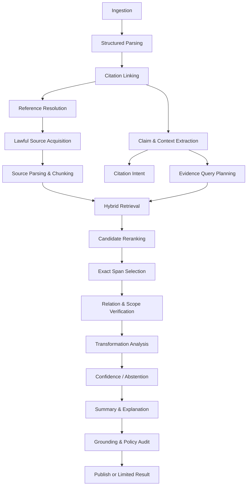

# CiteTrace Agent & AI Pipeline

> **Version:** 1.0.0  
> **Principle:** Retrieve and validate evidence before generating explanations.

---

## 1. Pipeline contract

The pipeline transforms a citing-document asset and a selected citation target into a versioned `EvidenceLink`. The core unit is not “a chat answer”; it is:

```text
CitingClaim + CitedWorkVersion + SourceEvidenceSpan
+ CitationIntent + EvidenceRelation + Transformation
+ ConfidenceVector + Provenance + AuditDecision
```

Each stage can abstain. No later stage may fabricate missing output from an earlier stage.

---

## 2. Orchestration graph



---

## 3. Stage 1 — Ingestion

### Inputs

- user upload or supported URL
- workspace and actor
- intended retention/sharing policy
- optional claimed identifier

### Deterministic checks

- accepted MIME and magic bytes
- file size and page-count budget
- encryption/password state
- decompression ratio
- malware/content-disarm policy
- checksum and duplicate policy
- tenant authorization

### Output

`SourceAsset` with immutable checksum, storage key, provenance, policy and security status.

### Abstention/failure

- `unsupported_media_type`
- `encrypted_document`
- `document_too_large`
- `malicious_content_detected`
- `policy_denied`

---

## 4. Stage 2 — Structured parsing

### Parser

Initial baseline: GROBID `processFulltextDocument` in isolated service mode. Request coordinates for citation references and other required structures. Store raw TEI plus normalized domain representation.

### Normalization

- section hierarchy
- paragraph and sentence boundaries
- normalized text with offset map
- bibliography entries
- in-text citation anchors
- citation clusters
- page/bounding coordinates
- figures, tables, equations and captions where available

### Parse quality features

- body/reference coverage
- unmatched citation anchor ratio
- bibliography completeness
- coordinate coverage
- invalid character and reading-order anomalies
- page-to-text consistency sample

### Output

`ParsedDocumentVersion` and `ParseQualityReport`.

### Policy

A low parse score narrows features; it does not silently proceed with full confidence.

---

## 5. Stage 3 — Citation linking and claim extraction

### Citation cluster handling

A sentence can cite one target, multiple targets, or a range. Represent:

- one `CitationCluster`
- one or more `CitationAnchorTarget`
- one or more atomic `CitingClaim`
- probabilistic or explicit claim-to-target association

### Claim extraction requirements

Preserve:

- negation and hedging
- quantified magnitude
- population/data/task
- condition and temporal scope
- metric/outcome
- causal language
- citation target association

### Recommended method

1. deterministic citation span removal for linguistic analysis while preserving offsets,
2. sentence and neighboring context construction,
3. structured model extraction into atomic claims,
4. rule-based validation that each claim text maps to source context,
5. cluster-aware target association.

### Example schema

```json
{
  "claim_text": "The approach remains effective with limited labeled data.",
  "source_span": {"start": 1241, "end": 1302},
  "qualifiers": ["limited labeled data"],
  "claim_strength": "assertive",
  "target_reference_ids": ["ref-12"],
  "association_confidence": 0.91
}
```

---

## 6. Stage 4 — Reference resolution

### Candidate generation

Generate candidates from:

1. exact DOI/arXiv/PMID if valid,
2. normalized identifier aliases,
3. title/author/year query across providers,
4. venue/pages/volume where available,
5. citation graph neighbors when justified.

### Feature vector

- exact identifier match
- normalized title similarity
- author overlap and first-author match
- year distance
- venue similarity
- volume/issue/page match
- provider agreement
- reference string coverage
- version relationship plausibility

### Baseline scoring

The implementation may learn weights later, but the initial score is transparent:

```text
identity_score =
  1.00 * exact_identifier
+ 0.35 * title_similarity
+ 0.20 * author_overlap
+ 0.10 * year_score
+ 0.10 * venue_score
+ 0.10 * pagination_score
+ 0.15 * provider_agreement
```

Scores are normalized and calibrated on a resolution gold set. Exact identifier conflicts trigger review rather than blind trust.

### Selection policy

A candidate is selected only if:

- score ≥ configured absolute threshold,
- margin over second candidate ≥ configured margin,
- no hard metadata conflict,
- work/version rules pass.

Otherwise status is `ambiguous` or `unresolved`.

### Version selection

Separate canonical intellectual work from asset version. Prefer the version cited by year/venue when available, but record links to preprint and journal versions. Never infer that two versions are text-identical.

---

## 7. Stage 5 — Lawful source acquisition

### Source order

1. existing authorized workspace asset
2. direct OA repository/publisher asset with recorded license/access
3. OA location from approved locator
4. provider abstract
5. metadata only

### Acquisition record

- source URL and final URL
- discovery provider
- access timestamp
- license and host
- content type and checksum
- work/version association
- access level
- policy decision
- redirect chain and validation status

### Security

- HTTP(S) only
- DNS/IP validation before and after redirects
- block local, link-local and cloud metadata ranges
- content-length and streaming limits
- same file security checks as user upload
- host allowlist or risk-based approval

---

## 8. Stage 6 — Source parsing and chunking

### Chunk types

- title/abstract
- section paragraph
- sentence window
- algorithm block
- equation with surrounding prose
- table region and caption
- figure caption and referenced paragraph
- appendix paragraph

### Chunk fields

- source asset/version
- section path
- page
- normalized text and offsets
- bounding boxes
- evidence type
- citation/reference links inside source
- token length
- lexical search vector
- embedding profile/version

### Chunking policy

Prefer semantic/structural boundaries. Use overlap only where needed and preserve exact offset mapping. Do not create a quote from concatenated non-contiguous chunks without showing that it is composite.

---

## 9. Stage 7 — Citation intent

### Input

Citing claim, surrounding context, section role and reference metadata.

### Output

Multi-label distribution with evidence spans in the citing paper.

### Model strategy

- rules for strong lexical signals (`we use`, `following`, `unlike`, `dataset`)
- classifier or structured LLM for context-sensitive labels
- calibration per domain/section
- multi-label thresholding

### Guardrail

Intent is about how the citing paper uses the reference. It does not require the cited source to actually justify that use; that is relation verification.

---

## 10. Stage 8 — Evidence query planning

For each claim, create 2–6 bounded query variants:

- proposition-preserving lexical query
- terminology aliases from source title/abstract
- method/dataset/metric identifier query
- scope-focused query
- contradiction/counterevidence query for strong assertions

Query generation output is structured and cannot request arbitrary web actions.

Example:

```json
{
  "queries": [
    {"kind": "proposition", "text": "performance with few labeled examples"},
    {"kind": "method", "text": "semi-supervised low-label evaluation"},
    {"kind": "scope", "text": "number of labels datasets experimental setting"}
  ],
  "required_concepts": ["limited labels", "performance"],
  "scope_terms": ["dataset", "label count"]
}
```

---

## 11. Stage 9 — Hybrid retrieval

### Candidate generation

Combine:

- PostgreSQL full-text/BM25-like lexical score
- vector similarity
- heading/section priors
- exact entity/identifier matches
- evidence-type priors
- claim-required concept coverage

### Reranking

A cross-encoder or structured verifier scores query–chunk relevance. Top candidates are diversified across sections/evidence types to reduce redundant paragraphs.

### Recommended initial top-k

- lexical candidates: 40
- vector candidates: 40
- merged unique candidates: up to 60
- reranked: top 10
- exact-span selection: top 3–5

These are configuration defaults, not hard-coded domain law.

### Counterevidence

For assertive support claims, search for limitation, failure, no-improvement, contrary and conditional language in the same source. Relation verification receives both supportive and limiting spans.

---

## 12. Stage 10 — Exact evidence span selection

A model can propose a span, but deterministic validation must confirm:

- span is exact substring of normalized asset text,
- offsets map to one asset version,
- page/section metadata exists or is explicitly unavailable,
- quote length is within product/legal display policy,
- no text has been generated or silently rewritten,
- composite evidence is marked and each part has its own span.

If the proposed text does not match, use offset/span repair constrained to the candidate chunk. If repair fails, discard it.

---

## 13. Stage 11 — Relation and scope verification

### Pairwise input

- atomic citing claim
- selected evidence spans
- limiting/counterevidence spans
- source abstract/conclusion context when permitted
- structured scope fields
- access level and version

### Two-pass method

#### Pass A — Structured extraction

Extract comparable source proposition and scope:

```json
{
  "source_proposition": "Accuracy improves when 10% of labels are available.",
  "scope": {
    "datasets": ["Dataset A", "Dataset B"],
    "task": "image classification",
    "metric": "accuracy",
    "condition": "10 percent labeled data",
    "claim_strength": "observed"
  }
}
```

#### Pass B — Relationship judgment

Compare proposition and each scope dimension, then output one primary relation plus observations.

### Ensemble policy

High-impact or unstable cases may use:

- independent verifier prompts/models,
- deterministic scope checks,
- disagreement score,
- human review threshold.

Model agreement alone is not proof; all outputs remain evidence-bound.

---

## 14. Stage 12 — Transformation and lineage

Transformation requires paired evidence from both documents where possible:

- source method/definition/result span
- citing method/statement span

Then identify:

- unchanged elements
- added elements
- removed elements
- parameter differences
- domain/task changes
- combination with other sources

Output example:

```json
{
  "labels": ["domain_transferred", "extended"],
  "unchanged": ["contrastive objective"],
  "changed": ["image encoder replaced with time-series encoder"],
  "added": ["temporal consistency regularizer"],
  "source_spans": ["span-src-1"],
  "citing_spans": ["span-cite-4", "span-cite-5"]
}
```

If only the citing paper claims an extension and the source text cannot be inspected, describe it as “the citing paper states” rather than verified transformation.

---

## 15. Stage 13 — Confidence and abstention

### Feature-based confidence

Confidence is computed from calibrated stage features, not directly copied from model self-confidence.

Examples:

- parse: coordinate coverage, anchor matching, text consistency
- resolution: candidate score, margin, identifier agreement
- source access: full/abstract, asset integrity, version certainty
- retrieval: rank stability, concept coverage, candidate agreement
- verification: model/rule agreement, scope completeness, calibration
- explanation: statement-to-evidence coverage and audit results

### Abstention rules

- resolution below threshold → `ambiguous_reference`
- no lawful content beyond metadata → `inaccessible_source`
- retrieval candidates below relevance floor → `no_relevant_evidence`
- top candidates conflict or verifier disagreement high → `insufficient_evidence`
- quote validation fails → block relation publication
- parse quality below mode threshold → `unsupported_document` or limited mode

---

## 16. Stage 14 — Explanation

Generate only after accepted relation/transformation objects exist.

### Output layers

1. one-sentence relationship summary
2. exact source evidence
3. detailed claim/scope comparison
4. what was adopted or changed
5. source-paper summary centered on current relevance
6. beginner explanation and prerequisites
7. reading recommendation
8. uncertainty and limitation statement

### Grounding representation

Every explanation sentence has:

```json
{
  "text": "The cited experiment supports performance under 10% labeled data, not a general low-data guarantee.",
  "supporting_span_ids": ["src-span-18", "cite-span-4"],
  "kind": "evidence_based",
  "confidence": 0.91
}
```

Inferences use `kind: inference` and an explicit qualifier.

---

## 17. Stage 15 — Quality audit

### Blocking invariants

- exact quote validation
- source asset/version present
- selected work/version and access level present
- relation has claim and evidence IDs
- taxonomy/version valid
- confidence values within range
- no hidden raw model output
- no unsupported URLs or identifiers
- no prompt/system secret leakage
- no public sharing beyond source policy

### Semantic checks

- explanation relation matches structured relation
- “direct support” not used on metadata-only content
- “contradicts” requires comparable scope
- transformation claims include paired evidence or qualified attribution
- unsupported broad language is removed

### Result

- `publish_verified`
- `publish_limited`
- `human_review_required`
- `blocked`

---

## 18. Model routing

### Routing goals

- cost-efficient default
- stronger verifier only for high-value uncertainty
- private deployment option
- provider failure resilience
- versioned reproducibility

### Example policy

```text
claim extraction: small structured model
intent: classifier or small structured model
query generation: small model
rerank: cross-encoder
relation verification: strong structured model
second verifier: only if confidence near threshold or review mode
explanation: medium model constrained to accepted evidence
quality audit: deterministic + separate small verifier
```

All routes are configured in `config/model-routing.example.yaml`.

---

## 19. Caching and reproducibility

Cache keys include immutable inputs and versions:

```text
hash(asset_checksum, parser_version, parser_options)
hash(reference_string, provider, adapter_version, provider_query_version)
hash(source_version_id, chunker_version, embedding_profile)
hash(claim_id, evidence_candidate_ids, verifier_profile, prompt_version, taxonomy_version)
```

A cache hit preserves the original provenance and does not masquerade as a new provider response.

---

## 20. Pipeline pseudocode

```python
async def analyze_citation(command: AnalyzeCitation) -> EvidenceCardResult:
    parsed = await parsing.require_valid(command.citing_asset_id)
    context = citation_context.build(parsed, command.anchor_id)

    resolution = await resolver.resolve(context.reference_entry)
    if not resolution.is_accepted:
        return limited_card.from_resolution(context, resolution)

    source = await acquisition.obtain(resolution.selected_work_version, command.workspace_id)
    if not source.has_analyzable_text:
        return limited_card.from_access(context, resolution, source)

    source_doc = await parsing.require_valid(source.asset_id)
    claims = await claim_extractor.extract(context)
    intents = await intent_classifier.classify(context, claims)

    cards = []
    for claim in claims:
        query_plan = await query_planner.plan(claim, resolution, source_doc)
        candidates = await retrieval.retrieve(source_doc, query_plan)
        spans = await span_selector.select_and_validate(source.asset_id, candidates)
        if not spans:
            cards.append(abstain.no_relevant_evidence(claim))
            continue

        verification = await verifier.compare(claim, spans, source.access_level)
        transformation = await transformer.compare_if_supported(claim, spans, parsed, source_doc)
        confidence = calibration.compute(parsed, resolution, source, candidates, verification)
        decision = abstention_policy.decide(confidence, verification, source)
        explanation = await explainer.render(decision, claim, spans, verification, transformation)
        cards.append(await auditor.audit(explanation))

    return aggregate(context, resolution, source, intents, cards)
```
