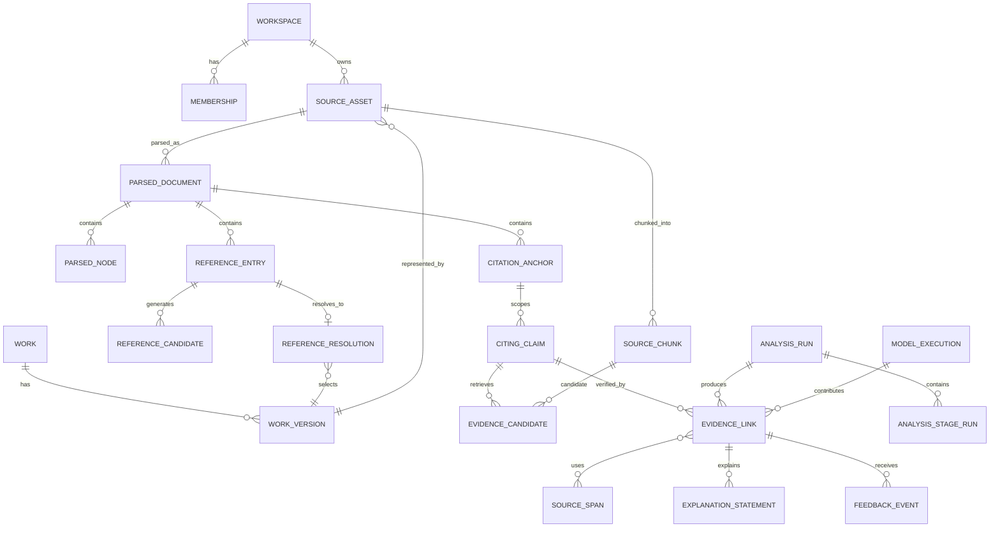

# CiteTrace Data Model & Provenance

> **Version:** 1.0.0  
> **Primary schema:** `contracts/db/schema.sql`

---

## 1. Modeling principles

1. Separate intellectual work, publication version, source bytes and parser output.
2. Use immutable or append-only records for evidence-producing artifacts.
3. Keep tenant ownership and source access policy explicit.
4. Represent exact spans and coordinates; do not store only generated text.
5. Store model/prompt/parser/taxonomy versions with every derived judgment.
6. Preserve candidate lists and rejected decisions needed for audit and evaluation.
7. Treat user correction as a new event, not an overwrite that destroys history.

---

## 2. Entity relationship overview



---

## 3. Identity model

### 3.1 Work

Represents one intellectual scholarly work independent of publication manifestation.

Fields:

- internal UUID
- normalized title
- primary authors
- first publication year
- external identifiers where applicable
- work type
- canonical metadata provenance
- merge/split history

### 3.2 WorkVersion

Represents a specific manifestation:

- arXiv revision
- conference paper
- journal article
- accepted manuscript
- repository manuscript
- correction or retraction notice

Fields:

- work ID
- version kind and label
- publication date/year
- venue
- DOI/arXiv/PMID or source-specific ID
- relationship to other versions
- status and notices

### 3.3 SourceAsset

Represents exact bytes or exact provider text analyzed.

Fields:

- workspace ownership or public-policy namespace
- work version association
- SHA-256 checksum
- media type and size
- object-store key
- acquisition method
- source and final URL
- access level and license
- access timestamp
- security scan result
- retention/deletion status

**Invariant:** Evidence spans always reference a source asset, not only a work ID.

---

## 4. Parsed document model

### 4.1 ParsedDocumentVersion

- source asset ID
- parser name/version/model profile
- parser options
- TEI/raw normalized artifact keys
- normalized text checksum
- parse quality grade and feature vector
- coordinate coverage
- created timestamp

A new parser version creates a new parsed-document version. It does not rewrite existing spans.

### 4.2 ParsedNode

A generic structural node:

- node type: section, heading, paragraph, sentence, caption, equation, algorithm, table region
- parent node
- order index
- normalized start/end offsets
- page start/end
- bounding boxes as JSON
- text checksum

### 4.3 Offset mapping

Store enough mapping to move between:

- source PDF page coordinates
- parser-produced normalized text
- UI-rendered structured text

When exact coordinate mapping is unavailable, mark it rather than inventing a page region.

---

## 5. Citation and reference model

### 5.1 ReferenceEntry

One bibliography item in the citing document:

- local label (`12`, `Smith2024`)
- raw reference string
- parsed title/authors/year/venue/identifiers
- parser confidence
- bibliography node/span

### 5.2 CitationAnchor

One in-text citation occurrence:

- anchor text and style
- source node/span and coordinates
- citation cluster ID
- one or more target reference entries
- parser/link confidence

### 5.3 CitationCluster

Groups targets appearing in one syntactic citation marker, such as `[3–7]` or `(A, 2021; B, 2022)`.

### 5.4 ReferenceCandidate

Every provider candidate is retained with:

- provider and provider record ID
- proposed work/version identifiers
- normalized metadata snapshot
- feature scores
- total score
- hard conflicts
- provider response provenance

### 5.5 ReferenceResolution

The selected decision:

- status
- selected work/version or null
- selected candidate ID
- absolute score and margin
- policy threshold version
- decision method: automatic, user-confirmed, adjudicated
- superseded-by relationship

---

## 6. Claim and evidence model

### 6.1 CitingClaim

- citation anchor/cluster
- exact citing-paper span
- atomic normalized claim text
- qualifiers and structured scope
- claim strength
- target reference associations
- extractor/model/prompt version

### 6.2 SourceChunk

- source parsed document/node
- exact offsets and page coordinates
- text
- section path and evidence type
- lexical search representation
- embedding ID/profile/version

### 6.3 EvidenceCandidate

Retains retrieval history:

- citing claim
- source chunk
- query-plan ID
- lexical/vector/entity scores
- merged rank
- reranker score/version
- candidate status

### 6.4 SourceSpan

The exact accepted evidence:

- source asset and parsed document version
- normalized start/end offsets
- page/section/bounding boxes
- exact quote checksum
- evidence type
- validation status/version
- display restriction metadata

### 6.5 EvidenceLink

Primary user-facing semantic record:

- citing claim
- resolved cited work version
- accepted source spans
- citation intent labels
- primary evidence relation
- scope observations
- transformation labels and paired citing spans
- confidence vector
- access level
- abstention/review status
- analysis run and model execution references
- audit decision

---

## 7. Explanation model

Generated prose is decomposed into `ExplanationStatement` records:

- statement text
- statement kind: evidence-based, inference, limitation, instruction
- supporting citing/source span IDs
- confidence
- model/prompt version
- audit status
- display order and audience mode

This structure allows the UI to reveal evidence sentence by sentence and enables unsupported-statement evaluation.

---

## 8. Analysis and model execution

### 8.1 AnalysisRun

- workspace, document and requested mode
- requested citation scope
- pipeline version
- status and progress
- idempotency key
- input fingerprint
- started/finished/cancelled timestamps
- aggregate cost and limitation summary

### 8.2 AnalysisStageRun

- analysis run and stage
- attempt number
- input fingerprint
- output artifact IDs
- status/error
- provider/model usage
- trace ID

### 8.3 ModelExecution

- purpose
- provider/model/version
- route/profile
- prompt template version
- input artifact hashes, not necessarily raw text in logs
- output schema version
- token/latency/cost
- validation and retry outcome
- privacy transmission policy

Raw prompts containing private paper text are retained only if workspace policy explicitly enables secure debugging; default production behavior stores hashes and safe metadata.

---

## 9. Confidence representation

Use a fixed named vector and separate calibration metadata.

```json
{
  "scores": {
    "parse": 0.98,
    "reference_resolution": 0.93,
    "source_access": 1.0,
    "evidence_retrieval": 0.84,
    "relation_verification": 0.78,
    "explanation_grounding": 0.96
  },
  "weakest_link": 0.78,
  "balanced_score": 0.912,
  "calibration_profile": "relation-en-cs-v1",
  "reasons": [
    {"stage": "relation_verification", "code": "scope_language_ambiguous"}
  ]
}
```

Do not compare scores from different calibration profiles as if they were identical probabilities.

---

## 10. Provenance record

Every external or derived fact can use a reusable provenance object:

- producer type: parser, provider, model, rule, user, annotator
- producer name/version
- source artifact IDs
- operation and parameters fingerprint
- timestamp
- license/access policy
- trace ID
- supersession chain

The user-visible “How was this determined?” view is built from these records, not generated ad hoc.

---

## 11. Tenant and policy model

### 11.1 Ownership

- public metadata may live in a shared public namespace under provider terms,
- private source assets belong to exactly one workspace,
- derived chunks/embeddings from private assets remain workspace-private,
- human feedback inherits the privacy of the underlying evidence unless explicitly sanitized and consented.

### 11.2 Row-level security

Workspace-scoped tables include `workspace_id`; API transactions set a trusted session variable used by RLS. Service roles that bypass RLS are restricted to audited maintenance paths.

### 11.3 Object keys

```text
private/{workspace_id}/assets/{asset_id}/{checksum}.pdf
private/{workspace_id}/parsed/{parsed_id}/document.tei.xml
public-oa/{license_policy_bucket}/{asset_id}/{checksum}.pdf
```

A public URL alone is not enough to classify content as redistributable.

---

## 12. Retention and deletion

### Default conceptual policy

- account/workspace policy defines private asset retention,
- derived artifacts expire with or before the source asset unless legally/audit-required,
- immediate access revocation on delete request,
- asynchronous object/database cleanup with status and receipt,
- backups age out according to documented schedule,
- public metadata and non-identifying provider cache follow separate policy.

Deletion does not erase externally published exports or records another user independently owns; UI must explain this boundary.

---

## 13. Versioning and supersession

Never mutate a judgment in place when the source, prompt, model, taxonomy or user correction changes.

Use:

- `supersedes_id`
- `superseded_at`
- `is_current` materialized/read-model flag
- reason and actor

Historical analysis remains auditable while the UI defaults to the latest accepted result.

---

## 14. Graph representation

The lineage graph is derived from evidence links:

### Nodes

- work versions
- methods/concepts/datasets/metrics where entity extraction is sufficiently reliable

### Edges

- cites
- adopts
- extends
- simplifies
- transfers_to_domain
- combines
- reuses_dataset
- reuses_metric
- contrasts

Each semantic edge carries supporting evidence-link IDs, confidence and version. An edge with no inspectable evidence is not shown as verified.

---

## 15. Data integrity invariants

1. Source span offsets must be within the normalized text length.
2. Quote checksum must match the source substring.
3. Evidence link and source span must belong to compatible work/version resolution.
4. Direct/partial/contradict relation cannot use `metadata_only` as its sole evidence.
5. Published transformation labels require source and citing spans or qualified attribution.
6. Private records referenced by an export must pass workspace policy.
7. Current result pointers cannot form supersession cycles.
8. Model output is not current until schema and quality audit pass.
9. Deleted source assets cannot be newly served or analyzed.
10. Every analysis-stage output has an input fingerprint and producer version.
